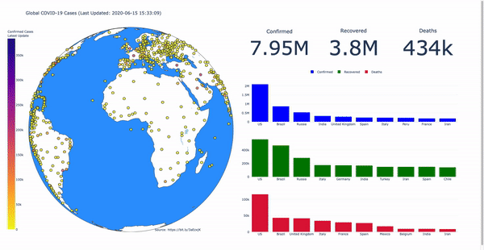

# [Covid-19 Dashboard](https://covid19-plotly-dash.herokuapp.com/)
Click on the link above to access the Covid-19 application deployed in Heroku! Check the .gif below to see how to use the web application or read the 'how to use' instructions below.

# How to use
1. Hover over to the top-right corner of the web application and select the `pan` tool. This allows for dragging the globe for displaying different corners of the world. 
2. Hover over various points of the application to display more information

To access the Github repo, **[click here](https://github.com/obaidhoque/covid19-plotly-dash)** to view. Do comment to let me know if I could have done this in a better way. 
